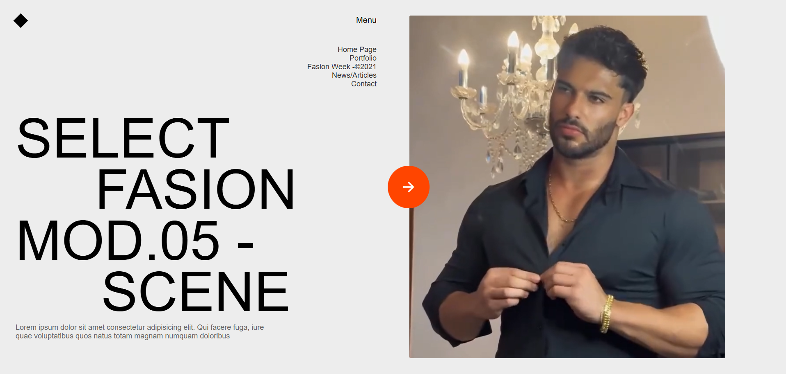
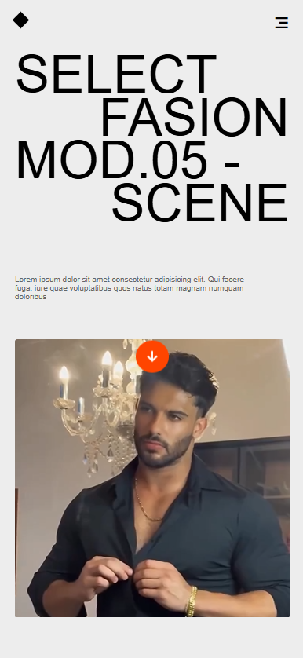

# Model Portfolio Website

A clean and responsive portfolio website for a fashion model, built using HTML and CSS. The design features a modern grid layout, a background video, and a smooth responsive interface for desktop and mobile devices.

---

## 🔍 Project Preview

### 💻 Web/Desktop View

---
### 📱 Mobile View

---
## ✨ Features

- Responsive grid-based layout
- Modern and minimal design
- Background video integration
- Mobile-friendly with media queries
- Icon support with Remix Icon

---

## 🛠️ Technologies Used

- HTML5
- CSS3
- Remix Icon (via CDN)

---